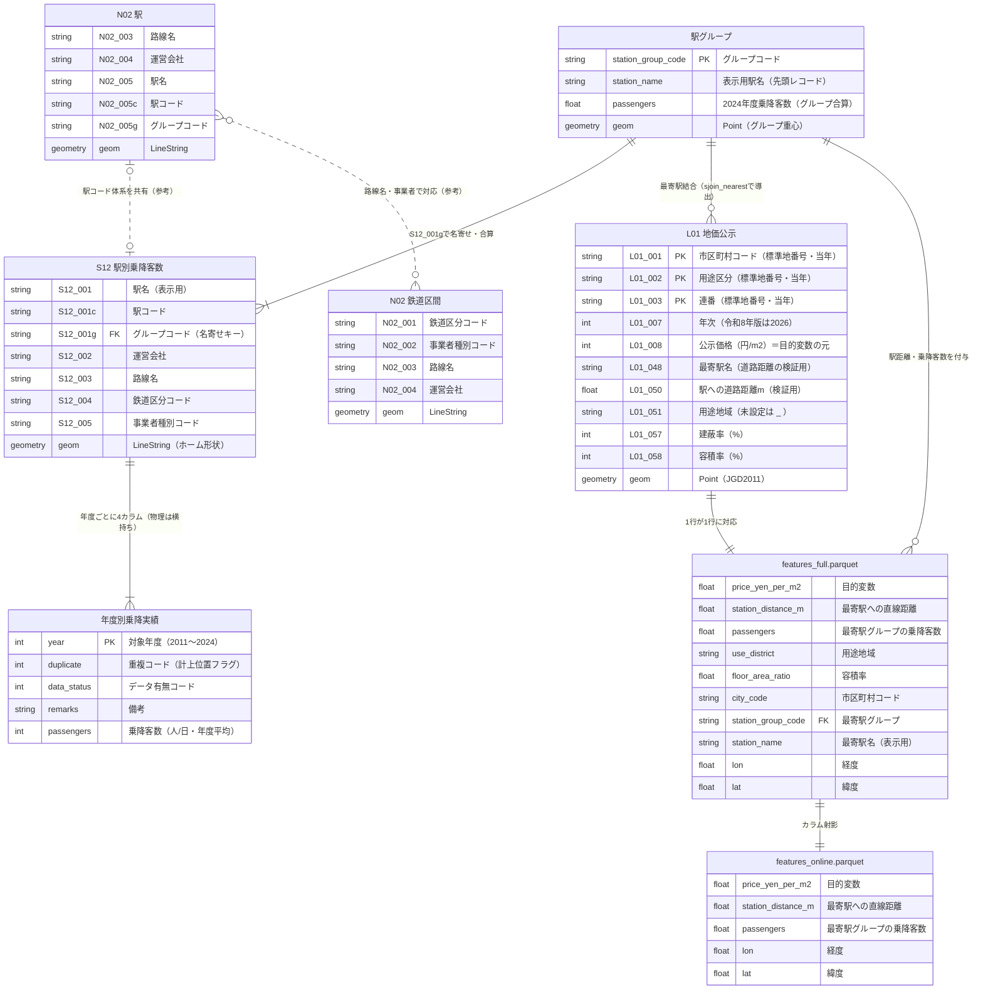

# データ構造（データモデル）

最終更新: 2026-07-08

本プロジェクトで使用する国土数値情報3データセット（L01・S12・N02）と、
前処理パイプラインの中間生成物・出力のデータモデルを整理する。
属性コード・コード値は2026-07-07にダウンロードした実データ
（L01-26 / S12-25 / N02-25。GML要素名・XSDとの突き合わせ）で確認済み。

## ER図



### 図の読み方・ER図に寄せた際の注意

- **`S12_YEAR` は論理エンティティ**。物理的には正規化されておらず、S12の1レコード上に
  年度ごとの4カラム（重複コード・データ有無コード・備考・乗降客数）が
  `S12_006`〜`S12_061` として14年度分横持ちされている（下記「S12」参照）
- **`STATION_GROUP` 以降は前処理パイプラインの生成物**（`pipeline/src/landprice/preprocess/`）。
  元データに存在するテーブルではない
- **`STATION_GROUP`—`L01` の関係は導出**。外部キーではなく `sjoin_nearest`（最近傍空間結合）で計算する
- 破線（非識別関係）はデータ間の参考対応。N02は今回のパイプラインでは使用していない
  （S12自身がジオメトリを持つため）

## 各データセットの詳細

### L01: 地価公示（令和8年版 L01-26）

- 25,565件・Pointジオメトリ（JGD2011）。1レコード＝標準地1地点
- 属性は `L01_001`〜`L01_148` の連番コード。年度により構成が変わるため、
  論理名へのマッピングは `pipeline/src/landprice/config.py` の `L01ColumnMap` で管理する
- 文字列属性の欠損表現は `_`

| ブロック         | 属性         | 内容                                                        |
| ---------------- | ------------ | ----------------------------------------------------------- |
| 識別             | L01_001〜006 | 標準地番号（市区町村コード・用途区分・連番）の当年/前年ペア |
| 価格             | L01_007〜009 | 年次、公示価格（円/m²）、対前年変動率                       |
| 属性移動         | L01_010〜023 | 選定状況・前年からの属性変更フラグ群                        |
| 土地・建物の現況 | L01_024〜047 | 分科会名、所在地番、地積、利用現況、建物構造、前面道路等    |
| 交通             | L01_048〜050 | 最寄駅名、近接区分、駅への道路距離(m)                       |
| 法規制           | L01_051〜060 | 用途地域、防火・区域区分、建蔽率、容積率等                  |
| 履歴             | L01_061〜105 | 選定年ビット列、1983〜2026年の44年分の公示価格履歴          |
| 履歴（属性移動） | L01_106〜148 | 年度ごとの属性変更フラグ（14桁×43年分）                     |

注意: L01の「最寄駅」は鉄道がない地域ではバス停等が入る（例: 石垣島のバスターミナル）。

### S12: 駅別乗降客数（S12-25）

- 10,534件・LineStringジオメトリ（ホーム形状）。1レコード＝駅×路線×事業者
- 「固定属性＋年度ブロックの横持ち」構造。対象年度の属性コードは次式で求める
  （`pipeline/src/landprice/preprocess/s12.py` の `year_column_codes`）:

```
開始番号 = 6 + (対象年度 - 2011) × 4
  S12_{開始番号}   : 重複コード
  S12_{開始番号+1} : データ有無コード
  S12_{開始番号+2} : 備考
  S12_{開始番号+3} : 乗降客数
例: 2024年度 → S12_058〜S12_061
```

- コード値（S12-25の `KsjAppSchema-S12-v3_3.xsd` で確認済み）:

| コード           | 値  | 意味                                                       |
| ---------------- | --- | ---------------------------------------------------------- |
| データ有無コード | 1   | データ有                                                   |
|                  | 2   | データなし                                                 |
|                  | 3   | 非公開                                                     |
|                  | 4   | 駅なし（当該年度に駅が存在しない）                         |
| 重複コード       | 1   | 当該路線駅に記載（乗降客数はこのレコードに計上）           |
|                  | 2   | 他路線駅に記載（別レコードに計上済み。値を使うと二重計上） |
|                  | 3   | 駅なし                                                     |

- 乗降客数を有効値として扱うのは「データ有無コード=1 かつ 重複コード=1」のレコードのみ
- `S12_001g`（グループコード）は「同名かつ300m以内」の駅グループに対し、
  グループ重心に最も近い駅の駅コードを持たせた属性。駅グループ名寄せの識別キー
- 版と収録年度の対応: S12-25は2011〜2024年度を収録。**S12-24は2023年度まで**のため使用しない

### N02: 鉄道（令和7年版 N02-25・今回未使用）

| レイヤ                      | 件数     | ジオメトリ | 属性                                                                   |
| --------------------------- | -------- | ---------- | ---------------------------------------------------------------------- |
| 駅（Station）               | 10,234件 | LineString | 鉄道区分・事業者種別・路線名・運営会社・駅名・駅コード・グループコード |
| 鉄道区間（RailroadSection） | 21,933件 | LineString | 鉄道区分・事業者種別・路線名・運営会社（駅属性なし）                   |

S12はN02の駅と同じ駅コード体系を共有する（実質、N02の駅に乗降客数統計を付与したもの）。
S12自身がジオメトリを持つため、今回の前処理はN02なしで完結している。

### 生成物（前処理パイプラインの出力）

- スキーマの正は `pipeline/src/landprice/schema.py`（Pydantic）。出力前にカラム名・型を検証する
- `features_online.parquet` は「任意地点クリックで再現可能な特徴量のみ」のサブセット。
  用途地域・容積率を含めない理由は実装計画「リスクと注意点」参照
- 実行方法・検証レポートの説明は `data/README.md` 参照

## 関連ファイル

- 属性コードマッピング・コード値の設定: `pipeline/src/landprice/config.py`
- 論理カラム名の定義: `pipeline/src/landprice/columns.py`
- テストシナリオ（データの癖の仕様化）: `docs/plan/test/preprocessing.feature`
- データの取得手順・出典: `data/README.md`
